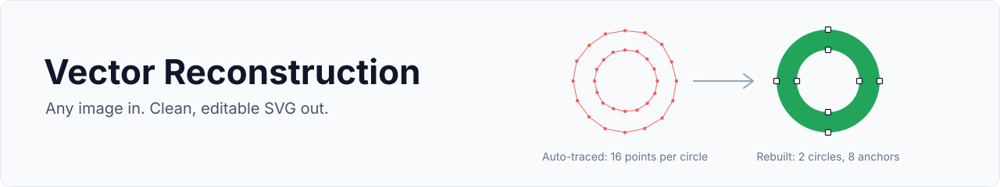

<p align="center">
  
</p>

# Vector Reconstruction

An AI skill that rebuilds an existing image as a clean, editable SVG, the way a senior
designer would: it treats auto-tracing as a rough draft, removes debris and duplicate
shapes, recovers the real geometry (circles, arcs, true curves, redrawn letters), snaps
colors to a clean palette and checks the result at real sizes.

**All it needs is the image.** It creates its own contour evidence from the image.
You can also give it an existing SVG to clean up. Detailed drawings and illustrations
(pencil, ink, blueprint, sketches) are accepted too: they are vectorized automatically as
tonal layers of one ink color, which is good rather than perfect.

## Install

**Codex or Claude Code** (needs Node.js; run it once, then start a new chat or session):

```sh
npx -y skills add banzy/vectorizer --full-depth -a codex -g -y
npx -y skills add banzy/vectorizer --full-depth -a claude-code -g -y
```

<details>
<summary>Manual install</summary>

Download this repo (**Code → Download ZIP**) and copy the `vector-reconstruction` folder to:

- Claude Code: `~/.claude/skills/` (all projects) or `.claude/skills/` (one project)
- Codex: `~/.codex/skills/`
- Claude.ai / Claude desktop: zip the folder so `vector-reconstruction/` is at the top
  level, then upload it in **Settings → Capabilities → Skills**.

</details>

## Use it

Attach the image and ask:

> Use the vector-reconstruction skill to vectorize this image.

That is all it needs. It works out the details itself and replies with a single link that
downloads the finished, editable SVG. No questions, no report.

- **It takes a few minutes.** The quality comes from the full workflow (trace, rebuild,
  remove duplicates, check at small sizes), so let it finish.
- **Use a strong model.** Tested with Sonnet 5.5; use that or better. Smaller, faster
  models (Haiku-class) will likely give rougher geometry, and the model must be able to
  see images. The skill tells you in one line if it thinks the model is under-powered.
- Optional: name the use (web, print, cutting, embroidery, animation) or anything that
  must stay exactly as is, such as a color value or a letter shape.

## Use it on any other platform

Any AI chat that accepts image uploads can follow the skill, even without a skill loader.

1. Upload the image.
2. Upload or paste [`vector-reconstruction/SKILL.md`](vector-reconstruction/SKILL.md) as
   the instructions (add [`production-targets.md`](vector-reconstruction/references/production-targets.md)
   if you can attach a second file).
3. Send:

> Follow the attached Vector Reconstruction instructions and vectorize the uploaded image.
> Give me the finished SVG as a downloadable file or link.

What to expect:

- **With code execution** (e.g. ChatGPT with data analysis, Claude with code execution):
  also upload the `scripts` folder. The assistant can then trace the image, render and
  compare the result and audit the SVG, as described below.
- **Without code execution**: the assistant works from looking at the image. It can
  still follow the design method, but it cannot measure overlap or render checks, so
  open the SVG yourself at several sizes (including 16–32 px) and compare it with the
  original. The result is returned as SVG code to save as a `.svg` file.
- Chat assistants can produce a plausible but imperfect result. Review the output, and
  ask for another pass on any part that drifted.

## What it does

1. Decides what must be preserved and the output target.
2. Traces the image into per-color contours and a core palette.
3. Removes debris: background rectangles, specks, fake white knockouts, stacked
   duplicates and hidden shapes.
4. Infers construction: shared centres, repeated radii and widths, radial ends, tangent fillets, basic figures (a near-circle is a circle, a near-square a square), alignment, symmetry.
5. Rebuilds with true primitives, arcs and deliberate Béziers; redraws lettering.
6. Simplifies without changing the character, then organizes colors, holes and groups.
7. Validates against the source, in outline mode and at small sizes.

## Optional helper scripts

Python 3. `extract_contours.py`, `trace_lineart.py`, `compare_rasters.py` and `render_svg.py --sizes` also
need Pillow (`python3 -m pip install Pillow`); `fit_curves.py` also needs numpy (`python3 -m pip install numpy`). `render_svg.py` needs one SVG renderer
(`rsvg-convert`, cairosvg, Inkscape or Chrome). `inspect_svg.py` needs nothing extra.
The skill runs these itself when it can:

```sh
python3 vector-reconstruction/scripts/extract_contours.py logo.png --out evidence
python3 vector-reconstruction/scripts/fit_curves.py logo.png --out fitted.svg
python3 vector-reconstruction/scripts/render_svg.py candidate.svg rendered.png --width W --height H
python3 vector-reconstruction/scripts/compare_rasters.py evidence/source.png rendered.png --out comparison
python3 vector-reconstruction/scripts/trace_lineart.py drawing.png --out drawing.svg
python3 vector-reconstruction/scripts/inspect_svg.py candidate.svg --out inspection --target web
python3 vector-reconstruction/scripts/render_svg.py candidate.svg sizes.png --sizes 16 24 32 48 64
python3 vector-reconstruction/scripts/download_page.py logo.svg --name Acme --out download.html
```

They trace the image (`fit_curves.py` rebuilds every edge as the simplest true primitive the measurements support: exact lines, exact arcs with shared centres, equal radii and widths, radial ends and tangent fillets, exact circles, ellipses, rectangles, squares, triangles and regular polygons wherever a shape is practically one, and few smooth Béziers for everything else), render the SVG, measure overlap, audit it (duplicates, hidden
shapes, bad joins, arcs that are almost but not exactly concentric, separate same-color shapes
drawn edge to edge where a seam could show, open paths, live strokes; wireframe included) and make a small-size
legibility sheet. `download_page.py` builds the one-button download page that the skill
publishes as an Artifact in Claude's apps. Use `--help` on any script. `prepare_evidence.py` is only needed if
you already have a `logo-designer-brief` JSON export from the web app.

## Repository

```text
assets/banner.svg                 the banner above
vector-reconstruction/
├── SKILL.md                      instructions
├── agents/openai.yaml            Codex metadata
├── references/                   export format, production targets
└── scripts/                      the helpers above
```

No API keys, hosted service or images are bundled. Source images and generated SVGs are
your inputs and outputs.
